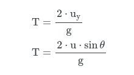
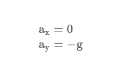

# Projectile
A projectile launch simulation using the graphics library in `C++`. The application has a user friendly menu interface to explain keyboard functionality as well as the navigation options within the application.

This project helps users visualtise the equations of projectile motion by watching a ball being projected across the screen as the user changes the **angle of projection** and **the intial velocity** with which the ball is projected using keyboard presses!

The project has been written using Dev C++ IDE on Windows. To run the application simply open the project file `sdfs` and then head to `Excecute > Run`.

## Theory 

Projectile motion is a form of motion where an object moves in a bilaterally symmetrical, parabolic path. The path that the object follows is called its trajectory. Projectile motion only occurs when there is one force applied at the beginning on the trajectory, after which the only interference is from gravity.

The equations that govern projectile motion are listed below.

The **initial velocity** can be expressed as x components and y components, where `u` stands for initial velocity magnitude and `θ` refers to projectile angle.

The **time of flight** of a projectile motion is the time from when the object is projected to the time it reaches the surface.

In projectile motion, there is no **acceleration** in the horizontal direction. The acceleration, a, in the vertical direction is just due to gravity, also known as free fall.

The horizontal **velocity** remains constant, but the vertical velocity varies linearly, because the acceleration is constant. 

The corresponding **displacement** components are as follows.

We can use the displacement equations in the x and y direction to obtain an equation for the **parabolic form** of a projectile motion.

The **maximum height** is reached when the velocity in the y direction is `0`. Using this we can rearrange the velocity equation to find the time it will take for the object to reach maximum height.

From the displacement equation we can find the maximum height.

The **range** of the motion is fixed by the condition `y = 0`. Using this we can rearrange the parabolic motion equation to find the range of the motion.

## User Interface 

### Menu
The menu page contains three clickable buttons that can be used to access the three screens in the application.

### Definitions
The information page contains handy definitions related to projectile motion.

### Controls
The controls page lists the keyboard controls of the application.

### Projectile

The projectile page is where the user controlled ball animation takes place along with a view of a dashboard on top that is updated along with the position of the ball to display projectile variables!

